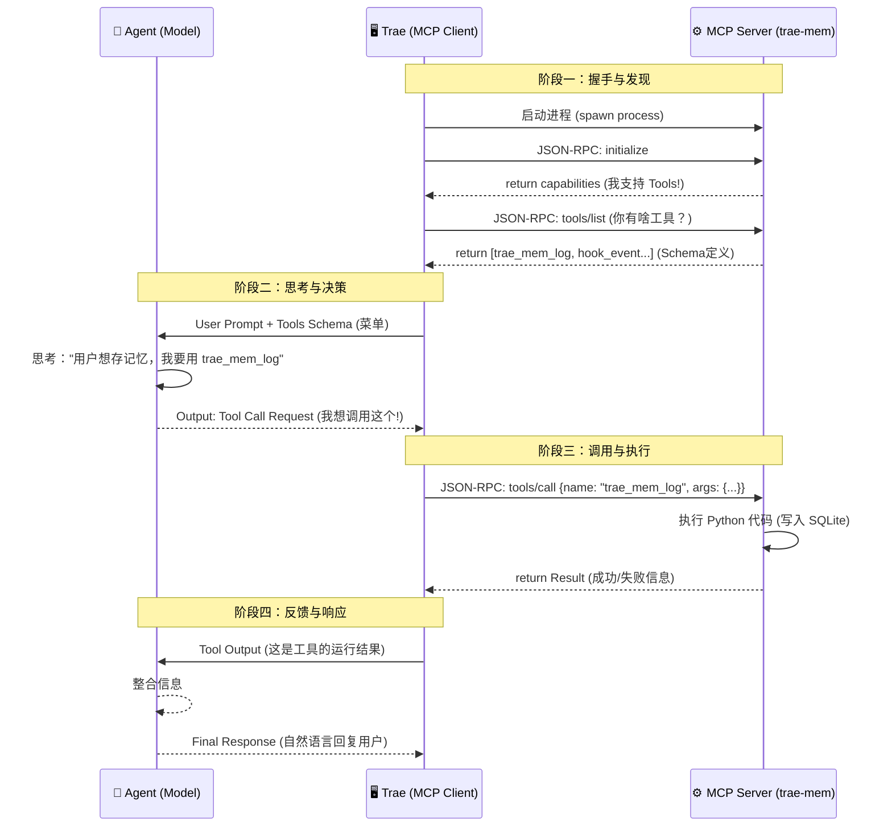

# 彻底搞懂 MCP：Trae、Agent 与插件服务端的“三角协同”原理解析

在 AI 编程工具（如 Trae, Cursor, Windsurf）爆发的今天，你可能听说过 **MCP (Model Context Protocol)** 这个词。它是 Anthropic 推出的一个开放标准，被称为 AI 时代的 "USB 接口"。

但它具体是如何工作的？当你在 Trae 里安装了一个插件（比如 `trae-mem`），当你对 AI 说“帮我保存这段记忆”时，底层到底发生了什么？

本文将通过 `trae-mem` 的实际代码，带你深入解构 **Trae（宿主/客户端）**、**Agent（大模型/大脑）** 和 **MCP Server（服务端/工具手）** 之间的交互原理。

---

## 一、 核心角色：谁在做什么？

在一个典型的 MCP 工作流中，有三个关键角色，它们的关系类似于**操作系统、CPU 和 应用程序**。

### 1. MCP Host (Trae IDE) —— “总线与连接器”
Trae 是整个系统的宿主（Host）。
*   **它的职责**：负责启动 MCP Server 进程，管理标准输入/输出（Stdio）通道，并将 Server 提供的工具清单（Tools List）“喂”给大模型。
*   **类比**：它是电脑的主板和操作系统，负责把外设（MCP Server）接入进来，并让 CPU（Agent）能看到它们。

### 2. MCP Server (服务端) —— “能力提供者”
这是一个独立运行的进程（例如我们的 `python -m trae_mem.mcp_server`）。
*   **它的职责**：它不知道 Agent 是谁，也不懂自然语言。它只懂 **JSON-RPC** 协议。它暴露了一组具体的**工具（Tools）**、**资源（Resources）** 或 **提示词（Prompts）**。
*   **类比**：它就像一个 USB 键盘或打印机驱动。它有具体的功能（打印、按键），但需要有人来调用。
*   **代码实例**：`trae-mem` 暴露了 `trae_mem_log`, `trae_mem_search` 等工具。

### 3. Agent (大模型) —— “决策大脑”
这是运行在云端（或本地）的 LLM（如 Claude 3.5 Sonnet, GPT-4）。
*   **它的职责**：它负责理解用户的自然语言意图，查看 Trae 给它的“工具菜单”，并决定**是否调用**以及**如何调用**某个工具。
*   **注意**：Agent **不能直接运行代码**，它只能输出一个“我想调用工具 X”的文本指令。

---

## 二、 交互四部曲：从启动到执行

让我们看看这三者是如何通过 MCP 协议舞动起来的。我们将流程分为四个阶段。

### 流程图总览



### 阶段一：握手与发现 (Handshake & Discovery)

当你在 Trae 的 `mcp.json` 中配置好服务并重启 IDE 时：

1.  **启动**：Trae 在后台悄悄运行了 `python3 -m trae_mem.mcp_server`。
2.  **初始化 (`initialize`)**：
    Trae 发送一个 JSON 包给 Server，说：“你好，我是客户端，协议版本 2024-11-05”。
    Server 回复：“你好，我是 `trae-mem`，版本 0.1.0，我支持 Tools 能力”。
3.  **列出工具 (`tools/list`)**：
    Trae 问：“请把你支持的所有工具列表发给我。”
    Server 会返回一个巨大的 JSON 列表，其中包含了每个工具的 `inputSchema`。

    > **关键代码 (`mcp_server.py`)**:
    > ```python
    > {
    >     "name": "trae_mem_hook_event",
    >     "description": "适配生命周期事件...",
    >     "inputSchema": {
    >         "type": "object",
    >         "properties": { "event": {...}, "payload": {...} },
    >         "required": ["event", "payload"]
    >     }
    > }
    > ```
    > *这段 JSON 就是 Agent 后来能读懂的“说明书”。*

### 阶段二：思考与决策 (Reasoning)

现在，用户在聊天框输入：**“我刚修复了登录 bug，帮我记录一下。”**

1.  **构建上下文**：Trae 将用户的这句话，连同刚才 Server 发来的“工具说明书”，一起打包发给 Agent（大模型）。
2.  **模型思考**：
    Agent 读到说明书，发现有一个工具叫 `trae_mem_log`，描述是“写入一条观测...”。
    Agent 认为：“这个工具符合用户的需求。”
3.  **生成调用请求**：
    Agent **不会**直接执行 Python 代码，它只是返回一段特定的文本（通常是 XML 或 JSON 格式），告诉 Trae：
    > *“请帮我调用 `trae_mem_log`，参数是 `text='修复登录bug', kind='user'`。”*

### 阶段三：中转与执行 (Execution)

Trae 拦截到了 Agent 的这个请求。

1.  **协议转换**：Trae 将 Agent 的意图转换为标准的 MCP JSON-RPC 请求，通过 Stdin 管道发给 Server。
    ```json
    {
      "jsonrpc": "2.0",
      "method": "tools/call",
      "id": 10,
      "params": {
        "name": "trae_mem_log",
        "arguments": {
          "session": "current",
          "kind": "user",
          "text": "修复登录bug"
        }
      }
    }
    ```
2.  **Server 干活**：
    `mcp_server.py` 的主循环收到这行 JSON，解析出 `name` 和 `arguments`，然后调用对应的 Python 函数操作 SQLite 数据库。
3.  **返回结果**：
    操作完成后，Server 打印结果到 Stdout：
    ```json
    {
      "jsonrpc": "2.0",
      "id": 10,
      "result": {
        "content": [{ "type": "text", "text": "observation_id_12345" }]
      }
    }
    ```

### 阶段四：闭环 (Loop Closure)

Trae 收到这个结果，把它通过 Prompt 再次喂回给 Agent。
Agent 看到结果：“哦，工具执行成功了，返回了 ID。”
Agent 最终回复用户：“**已为您记录该修复操作（ID: ...）。**”

---

## 三、 为什么这种架构很牛？

理解了这个原理，你就明白了 MCP 的三大优势：

1.  **安全性 (Security)**：
    Agent 永远无法直接触碰你的硬盘或网络。它只能请求 Trae 调用 Server 暴露出来的有限的几个工具。如果 Server 没写“删除文件”的工具，Agent 就算想删也删不掉。

2.  **通用性 (Universality)**：
    `trae-mem` 只需要写一次 MCP Server，就可以同时被 Trae、Claude Desktop、Zed Editor 等任何支持 MCP 的客户端使用。就像 USB 键盘插哪台电脑都能用。

3.  **本地化 (Local Control)**：
    Agent 可以在云端（OpenAI/Anthropic），但 MCP Server 跑在你本地。这意味着云端的大脑可以通过这个“本地手脚”来操作你本地的数据库、文件，实现了**端云协同**。

## 四、 总结

*   **Trae** 是**路由器**，负责转发消息。
*   **Agent** 是**指挥官**，负责下达指令。
*   **MCP Server** 是**工兵**，负责干脏活累活。

当你下一次在 Trae 里看到 AI 帮你查数据库、写文件时，请记得：这背后是一场精密的三方接力赛，而 **MCP 协议** 就是它们共同的接力棒。
